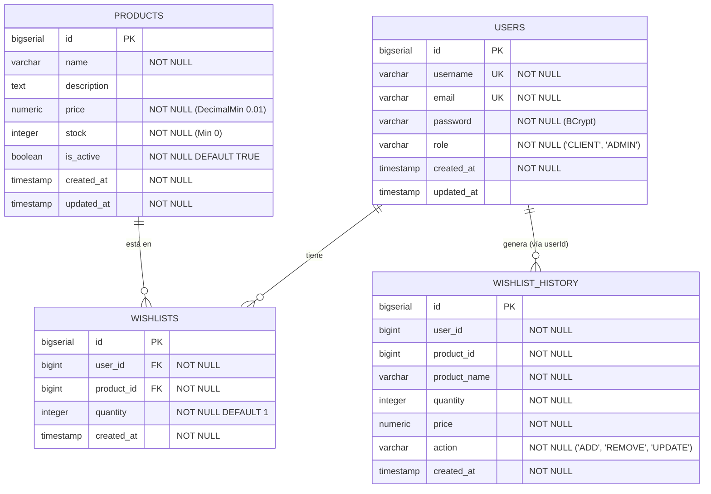

# 🗄️ Modelo de Base de Datos - Carvajal Wishlist

Este documento detalla la arquitectura de persistencia, el diagrama entidad-relación, el diccionario de datos y las justificaciones de diseño técnico para el microservicio de Lista de Deseos (*Wishlist*) de Carvajal.

---

## 1. Justificación de la Base de Datos Seleccionada

Para este microservicio se seleccionó **PostgreSQL 16** como motor relacional (RDBMS) por las siguientes razones de arquitectura e-commerce:

1. **Garantías ACID y Consistencia Estricta:** En operaciones de lista de deseos y control de inventario (`stock`), la concurrencia exige transaccionalidad estricta para evitar lecturas sucias y condiciones de carrera al consultar disponibilidad.
2. **Integridad Referencial:** Las relaciones entre usuarios, listas de deseos y catálogo de productos requieren claves foráneas (`FOREIGN KEY`) e índices únicos (`UNIQUE`) que aseguren que ningún ítem quede huérfano si un producto o usuario es modificado.
3. **Optimización con HikariCP y JPA:** Compatibilidad de primer nivel con Hibernate 6+ y Spring Data JPA, permitiendo control fino de transacciones mediante `@Transactional(readOnly = true)`.
4. **Auditoría e Inmutabilidad:** La tabla de histórico (`wishlist_history`) almacena eventos secuenciales inmutables con marcas temporales (`TIMESTAMP WITH TIME ZONE`).

---

## 2. Diagrama Entidad-Relación (ER)

---

## 3. Diccionario de Datos

### Tabla: `users`
Almacena las credenciales y el rol asignado a cada usuario en el sistema.

| Columna | Tipo de Dato | Nulo | Restricciones | Descripción |
| :--- | :--- | :---: | :--- | :--- |
| `id` | `BIGSERIAL` | No | `PRIMARY KEY` | Identificador único secuencial. |
| `username` | `VARCHAR(255)` | No | `UNIQUE` | Nombre de usuario único para autenticación. |
| `email` | `VARCHAR(255)` | No | `UNIQUE` | Correo electrónico único del usuario. |
| `password` | `VARCHAR(255)` | No | - | Contraseña cifrada mediante algoritmo BCrypt (costo 10). |
| `role` | `VARCHAR(50)` | No | `CHECK (role IN ('CLIENT', 'ADMIN'))` | Rol de seguridad para autorización Spring Security. |
| `created_at`| `TIMESTAMP` | No | - | Fecha y hora de creación automática (`@CreationTimestamp`). |
| `updated_at`| `TIMESTAMP` | Sí | - | Fecha de última actualización (`@UpdateTimestamp`). |

---

### Tabla: `products`
Catálogo maestro de artículos escolares, de oficina y tecnología ofrecidos por Carvajal.

| Columna | Tipo de Dato | Nulo | Restricciones | Descripción |
| :--- | :--- | :---: | :--- | :--- |
| `id` | `BIGSERIAL` | No | `PRIMARY KEY` | Identificador único del producto. |
| `name` | `VARCHAR(255)` | No | - | Nombre comercial del producto (no vacío). |
| `description` | `VARCHAR(255)` | Sí | - | Descripción detallada de características. |
| `price` | `NUMERIC(19, 2)`| No | `CHECK (price >= 0.01)` | Precio unitario del producto en moneda local. |
| `stock` | `INTEGER` | No | `CHECK (stock >= 0)` | Unidades físicas disponibles en inventario. |
| `is_active` | `BOOLEAN` | No | `DEFAULT TRUE` | Estado lógico del producto (activo/inactivo). |
| `created_at`| `TIMESTAMP` | No | - | Fecha de registro en catálogo. |
| `updated_at`| `TIMESTAMP` | No | - | Fecha de última modificación de stock o precio. |

---

### Tabla: `wishlists`
Representa los artículos actualmente activos en la lista de deseos de cada usuario.

| Columna | Tipo de Dato | Nulo | Restricciones | Descripción |
| :--- | :--- | :---: | :--- | :--- |
| `id` | `BIGSERIAL` | No | `PRIMARY KEY` | Identificador único del ítem en lista. |
| `user_id` | `BIGINT` | No | `FOREIGN KEY (users.id)` | Referencia al usuario dueño de la lista. |
| `product_id`| `BIGINT` | No | `FOREIGN KEY (products.id)` | Referencia al producto deseado. |
| `quantity` | `INTEGER` | No | `DEFAULT 1, CHECK (quantity > 0)` | Cantidad deseada por el cliente. |
| `created_at`| `TIMESTAMP` | No | - | Fecha en que se agregó el producto a la lista. |

*Regla de Unicidad de Negocio:* Un usuario no puede tener duplicado el mismo `product_id` en su lista activa (`ProductAlreadyInWishlistException`).

---

### Tabla: `wishlist_history`
Bitácora de auditoría histórica inmutable que registra cada interacción con la lista de deseos para analítica e inteligencia de negocios.

| Columna | Tipo de Dato | Nulo | Restricciones | Descripción |
| :--- | :--- | :---: | :--- | :--- |
| `id` | `BIGSERIAL` | No | `PRIMARY KEY` | Identificador secuencial del evento. |
| `user_id` | `BIGINT` | No | - | ID del usuario que ejecutó la acción. |
| `product_id`| `BIGINT` | No | - | ID del producto involucrado. |
| `product_name` | `VARCHAR(255)` | No | - | Snapshot del nombre del producto al momento del evento. |
| `quantity` | `INTEGER` | No | - | Cantidad seleccionada en el evento. |
| `price` | `NUMERIC(19, 2)`| No | - | Snapshot del precio unitario al momento del evento. |
| `action` | `VARCHAR(50)` | No | - | Tipo de operación: `'ADD'`, `'REMOVE'`, `'UPDATE'`. |
| `created_at`| `TIMESTAMP` | No | - | Marca de tiempo exacta del evento inmutable. |

---

## 4. Reglas de Integridad y Negocio Aplicadas

1. **Trazabilidad Desacoplada:** La tabla `wishlist_history` almacena instantáneas (*snapshots*) de `product_name` y `price` sin llaves foráneas duras a `products`, garantizando que si un producto se descataloga en el futuro, los registros históricos de auditoría no se corrompan ni pierdan contexto.
2. **Validación de Stock en Tiempo Real:** Al listar deseos (`GET /api/wishlist`), el servicio computa en caliente el estado `inStock = (product.isActive && product.stock >= item.quantity)` sin persistir estados efímeros, alertando de inmediato si `hasOutOfStockItems` es verdadero.
3. **Prevención de N+1:** Las consultas de historial y listas utilizan optimizaciones por lotes en repositorio (`findAllById` / joins controlados) para evitar sobrecarga de conexiones a la base de datos.
